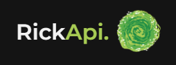
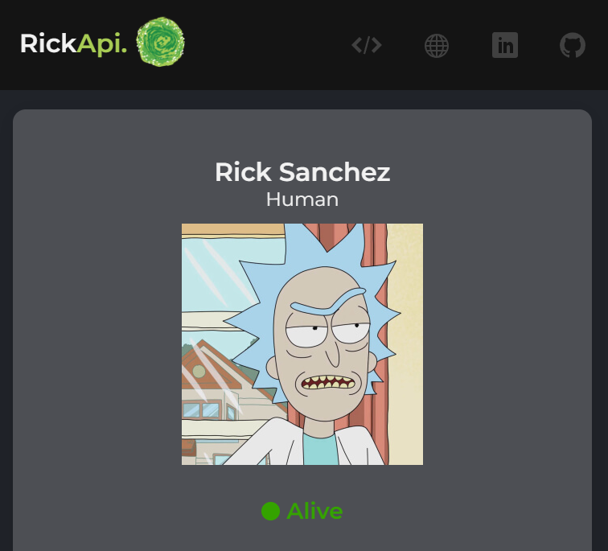

<div align="center">

</div>
<div align="center">

<p>    </p>

</div>


## -  Objective 🛠️
the objective of this React project is to understand how to use React to get responses from apis using axios.





## - Technologies 🚀️
On this project i used React to build the app and axios to consume the api. The api is and Rick and Morty api, you can check the api [here](https://rickandmortyapi.com/)

## - How to setup ⛳
First clone this project using:
```
git clone https://github.com/jravolio/RickApi.git
```
After that open you terminal on the RickApi folder and run:
```
yarn install
```
You just installed all the dependencies of the project, now just run:
```
yarn start
```

and the site should be functioning! :)


## - Future updates ⚡
```
✅ Add Loading
⬜ Put the site online
⬜️ Check details of each character
```
